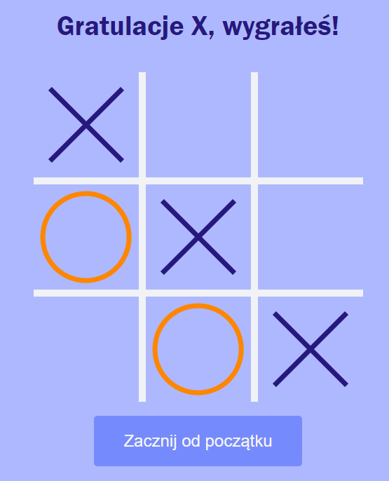
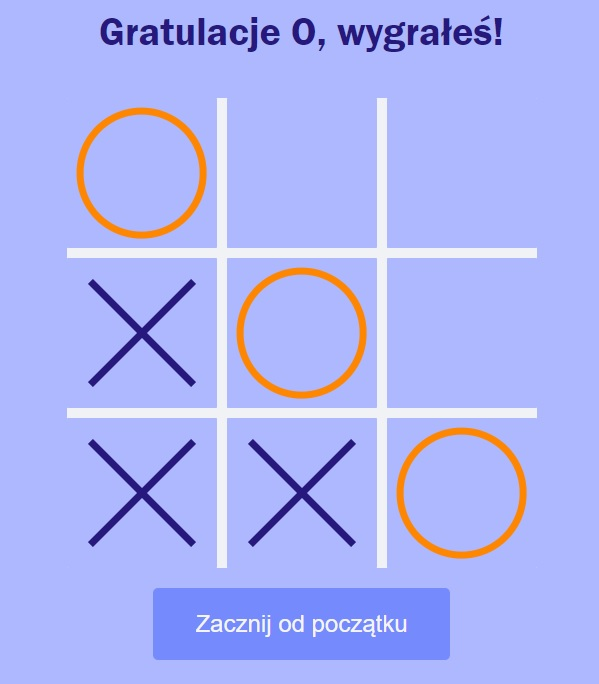
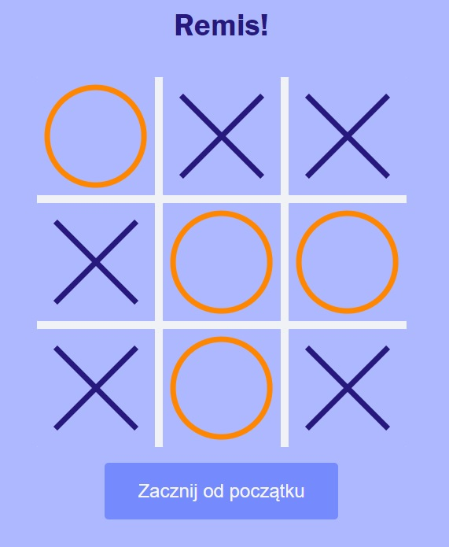

<h1 alig="center">
  

     TicTacToe
  

</h1>

* [Live](#live)
* [Technologies](#technologies)
* [General info](#general-info)
* [Screenshots](#screenshots)
* [Contact](#contact)

## Live
<h3> https://vneder.github.io/TicTacToe/</h3>

## Technologies
Project is created with:
* HTML
* CSS (RWD)
* JavaScript

## General info
* Klasyczna gra kółko i krzyżyk

## Screenshots

  

  

    

## Contact
* E-mail: lukasz.wozniakowski21@gmail.com
* LinkedIn: https://www.linkedin.com/in/lukasz-wozniakowski21/
